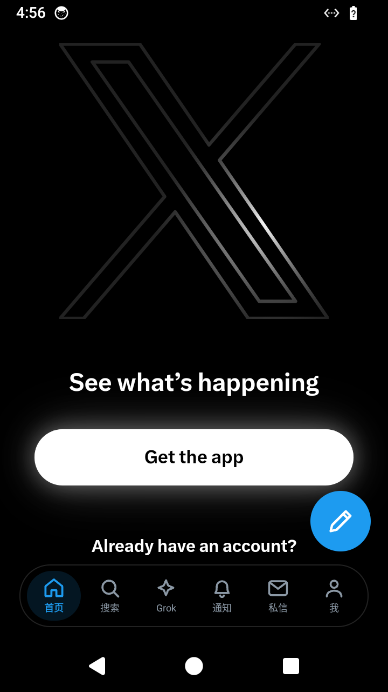
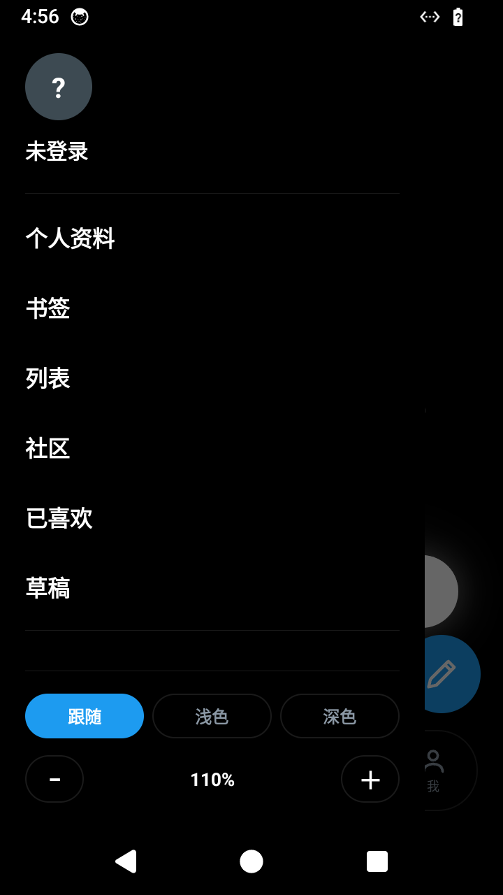
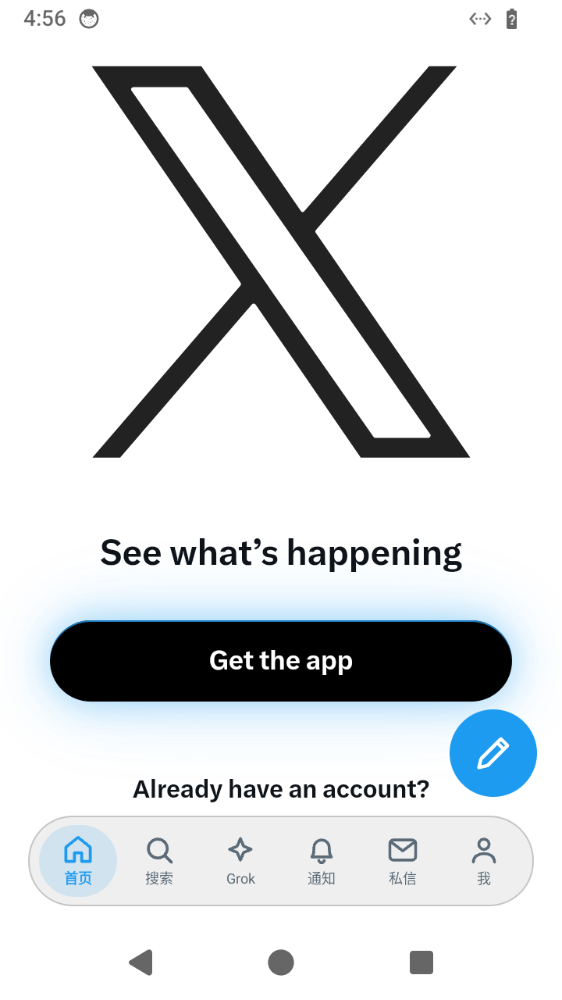
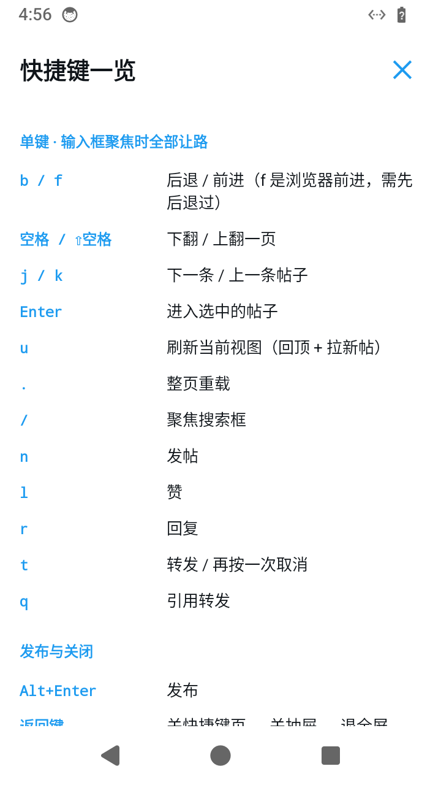
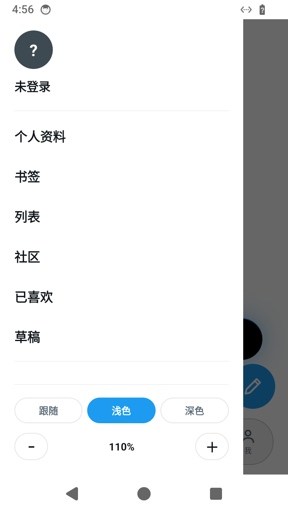

# x全键盘app

给实体全键盘安卓手机用的 X（Twitter）客户端。在 **Unihertz Titan Lite2** 上开发和测试。

---

## 1. 这就是个网页套壳

说在前面，免得有人以为这是什么正经客户端：

**它就是一个 WebView 套壳。** 把 X 的移动版网页装进 `WebView`，外面套一层原生导航，里面注入一段 JavaScript 改造页面和处理键盘。

- **不调用 X 的 API**，一行都没有
- **不碰你的账号密码**，登录走 X 网页自己的流程，cookie 存在 WebView 里
- **没有服务端**，没有任何数据经过第三方
- 数据、功能、限制，全部来自 X 网页本身。X 网页能干的它能干，X 网页不能干的它也不能干

所以它解决的不是"功能"问题，是**操作方式**问题：X 官方 App 和网页都假设你在用触屏，而实体键盘手机的价值恰恰在于手不用离开键盘。这个壳把常用操作全部映射成了按键。

零依赖：不用 AndroidX，不用任何第三方库，单个 Activity，APK **44KB**。

> 非官方项目，与 X Corp. 无关。

| 底栏 + 发帖按钮 | 抽屉 | 浅色 |
| --- | --- | --- |
|  |  |  |

（页面内容是 X 的未登录落地页 —— 截图环境登录不了，能看的只有外面这层壳。）

---

## 2. 快捷键

在 **Unihertz Titan Lite2** 上测试。这类键盘**没有 Ctrl、没有 Esc、没有 F 键、没有方向键**，所以下面的设计原则是：**每个功能都必须能用单键或前缀层按出来**，组合键只作为外接蓝牙键盘的补充。

App 内也有一份：抽屉 → `快捷键一览`，不用翻这个文件。



### 单键（输入框聚焦时全部让路）

| 键 | 作用 |
| --- | --- |
| `j` / `k` | 下一条 / 上一条帖子 |
| `Enter` | 进入选中的帖子 |
| `b` / `f` | 后退 / 前进（`f` 是浏览器前进，需先后退过） |
| `空格` / `⇧空格` | 下翻 / 上翻一页 |
| `u` | 刷新当前视图（回顶 + 拉新帖，不重载整页） |
| `.` | 整页重载 |
| `/` | 聚焦搜索框 |
| `n` | 发帖 |
| `l` | 赞 |
| `r` | 回复 |
| `t` | 转发 / 再按一次取消 |
| `q` | 引用转发 |

`j` / `k` 选中的帖子有蓝色描边，`Enter` / `l` / `r` / `t` / `q` 都作用在它身上。
打开列表页、刷新、切标签后会自动选中第一条，落地就能直接 `j` / `k`。

### 发布与关闭

| 键 | 作用 |
| --- | --- |
| `Alt+Enter` | 发布 |
| 返回键 | 关快捷键页 → 关抽屉 → 退全屏 → 关发帖框 → 网页后退 |
| 返回键 | 已在首页且无历史时，两秒内再按一次退出 |

### `g` 前缀层（按 `g` 后 1.2 秒内接第二个键）

| 组合 | 作用 | 组合 | 作用 |
| --- | --- | --- | --- |
| `g h` | 首页 | `g p` | 个人资料 |
| `g n` | 通知 | `g b` | 书签 |
| `g m` | @我的 | `g l` | 列表 |
| `g d` | 私信 | `g k` | 已喜欢 |
| `g s` | 搜索 | `g c` | 社区 |
| `g g` | Grok | | |

### `z` 前缀层（字号）

| 组合 | 作用 |
| --- | --- |
| `z k` / `z j` | 字号 ＋ / − |
| `z 0` | 复位 100% |

### 触屏

| 操作 | 作用 |
| --- | --- |
| 点已选中的 Tab | 回到顶部并刷新 |
| 长按「通知」 | 进 @我的 |
| 长按「首页」 | 打开抽屉 |
| 左边缘右滑 | 打开抽屉（手势导航的机器上会被系统返回手势吃掉） |

### 只有外接全键盘能按

代码里保留着，但 Unihertz Titan Lite2 这类键盘按不出来。每条都有等效的本机按法：

| 组合 | 本机用什么代替 |
| --- | --- |
| `Ctrl+Enter` | `Alt+Enter` |
| `F5` / `Ctrl+R` | `.` |
| `Alt+←` / `Alt+→` | `b` / `f` |
| `Ctrl+L` | `/` 或 `g s` |
| `Ctrl++` / `Ctrl+-` / `Ctrl+0` | `z` 前缀层 |
| `Esc` | 返回键 |

---

## 3. 详细说明

### 原生外壳

- **底部悬浮导航**：`首页` `搜索` `Grok` `通知` `私信` `我`，带选中态和未读角标
- **发帖**是右下角浮动按钮，只在根页面出现；发帖框打开时底栏和它一起让位，换成「发布」
- **抽屉**（点底栏 `我`）：个人资料 / 书签 / 列表 / 社区 / 已喜欢 / 草稿 / 设置与隐私 / 快捷键一览，底部是主题和字号

  
- **全屏视频**时所有原生浮层隐藏

### 主题

抽屉底部三个选项 `跟随` / `浅色` / `深色`，直接切整个 App。

原理是 X 把主题存在 `night_mode` cookie 里（`0` 浅色 / `1` Dim / `2` 纯黑），壳写这个 cookie 再重载，页面就换主题；外壳读页面实际背景色跟着变。所以**壳和页面永远一致**，不会出现壳白页面黑。选 `跟随` 则沿用你 X 账号自己的设置，Dim 走这条。

### 对页面做的改造

- 隐藏 X 自带的左侧导航栏、底部标签栏、浮动发推按钮、时间线顶部的发推框 —— 这些都和原生外壳重复了
- 详情页的回复框**保留**，那是回帖用的
- 正文区拉满宽度

### 切页不重载

底栏、抽屉、键盘三套入口的跳转，都是去**点击 X 自己的导航链接**来触发它的 SPA 路由，而不是 `location.href` 整页跳。所以切标签保得住滚动位置和时间线状态。找不到链接时才退回整页跳。

### 已知脆弱点

套壳的本质决定了它依赖 X 的 DOM 结构，X 改版就可能失效：

- 大量选择器依赖 `data-testid`
- **引用转发**靠菜单项文本匹配 `/quote|引用/i`，因为那一项没有稳定的 `data-testid`
- **时间线顶部发推框**靠「向上找第一个含 `toolBar` 且不含 `article` 的祖先」来定位

坏掉的时候基本都是这几处。

---

## 4. 关于名字和图标

名字是恶趣味。

图标用微博的红白配色也是恶趣味，纯属好玩，跟微博没有任何关系。

别多想。

---

## 5. 给 AI / 二次开发看

仓库里有两份给接手者的文档：

- [`CLAUDE.md`](CLAUDE.md) —— 架构、桥接口、必须遵守的约束
- [`NAVIGATION_PLAN.md`](NAVIGATION_PLAN.md) —— 导航重构的完整过程和每个决定的原因
- [`DEVELOPMENT_PROCESS.md`](DEVELOPMENT_PROCESS.md) —— 更早的设计历史和测试流程

### 编译环境

需要 **JDK 17** 和 **Android SDK**（compileSdk 36 / minSdk 24）。没有别的依赖，不需要联网拉包以外的任何东西。

```bash
export JAVA_HOME=/usr/lib/jvm/java-17-openjdk
export ANDROID_HOME=$HOME/Android/Sdk
./gradlew clean assembleDebug
# 产物：app/build/outputs/apk/debug/app-debug.apk
```

SDK 路径不对就写 `local.properties` 的 `sdk.dir=`。

**发布包一律用 `clean assembleDebug`** —— 增量构建打出来的 APK 压缩不充分，同样的 dex 内容出过 73KB vs clean 的 44KB。

### 自定义快捷键

键盘分两层，加键的时候改对应那层：

**单键和前缀层** → [`app/src/main/assets/injected-shortcuts.js`](app/src/main/assets/injected-shortcuts.js) 末尾的 `keydown` 监听：

```js
if (event.key === "x") { doSomething(); event.preventDefault(); }
```

开头那句守卫必须保留，它保证打字时单键全部让路：

```js
if (event.altKey || event.ctrlKey || event.metaKey || editable(document.activeElement)) return;
```

给 `g` 层加新组合，写在 `prefix === "g"` 那个分支里。要加一个全新的前缀层（比如 `x`），在这行的条件里加上它：

```js
if (event.key === "g" || event.key === "z") { setPrefix(event.key); return; }
```

再照着 `prefix === "z"` 的样子加一个分支。前缀 1.2 秒内没接到第二个键就自动清空。

**带修饰键的组合** → [`MainActivity.java`](app/src/main/java/guyii/social/tools/MainActivity.java) 的 `dispatchKeyEvent()`。注意 Activity 层先于 WebView 拿到事件，`return true` 之后页面就收不到了。

**改完记得同步 `MainActivity.SHORTCUTS` 数组**（App 内的快捷键一览）和本文件的表格。三处不同步的话，用户看到的和实际能按的就对不上了。

需要网页调原生（比如调字号），在 `ShortcutBridge` 加 `@JavascriptInterface` 方法；需要原生调网页，往 `window.__guyii` 加函数再用 `runPageAction()` 调。两边没有类型检查，改接口必须同时改。

### 改包名

当前包名 `guyii.social.tools`，改的话要动四处：

| 位置 | 改什么 |
| --- | --- |
| [`app/build.gradle.kts`](app/build.gradle.kts) | `namespace` 和 `applicationId` |
| `app/src/main/java/<包路径>/` | 目录结构跟着包名走 |
| `MainActivity.java` 第一行 | `package` 声明 |
| [`app/src/main/res/values/strings.xml`](app/src/main/res/values/strings.xml) | `app_name`（显示名，和包名无关但通常一起改） |

`AndroidManifest.xml` 里写的是相对的 `.MainActivity`，跟着 `namespace` 走，不用改。

### 换图标

[`app/src/main/res/drawable/ic_launcher.xml`](app/src/main/res/drawable/ic_launcher.xml) 是个手写的 vector drawable，直接改 `pathData` 或整个替换。

### 离线测试信息流功能

模拟器里登录不了 X，`j`/`k`、`Enter`、点赞转发这些全都验不了。[`testing/test-timeline.html`](testing/test-timeline.html) 是为此准备的本地假信息流，用法见 `DEVELOPMENT_PROCESS.md`。

---

## 下载

[Releases](../../releases) 里有编译好的 APK，附了大小和校验和。

也可以自己编（见上一节），零依赖，几秒就好。

---

## License

[MIT](LICENSE)
